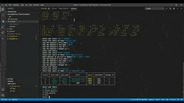

# Our Workplace : Team Organizer

   \

Project Repository: https://github.com/MrDawit/Our-Workplace-Team-Organizer \
Project Walkthrough Link: https://drive.google.com/file/d/1K9sRW9RXihJheJIiYJRwxEaCfnOYAuDb/view

## Table of contents
- [Description](#Description)
- [Installation](#Installation)
- [Usage](#Usage-Notes)
- [Created By](#Created-By)
- [Repository Link](#Repository)

## Description 
  Our Workplace: Team Organizer is an app that allows us to manage the details of our workforce. It brings together the simple functions of adding a roster to our team, then editing and viewing said roster.  All of this is done in a low resource app that can easily be accessed through a node terminal. Future development will include more functionality (i.e.- more search functions, a new table for managers and deleting options). Until then, enjoy all that is in the Our Workplace: Team Organizer app! 

## Installation

* Download and install mysql 
* Download the repository 
* In the "app.js" file, edit the value for your passowrd inside the  "mysql.createConnection" object equaling the passowrd for your mysql connection 
* Run "schema.sql" in your UI of choice so that the "our_workplace" database is created along with all the tables 
* In your node terminal, execute code "npm i" to install the dependcies for this package 
* If errors do not occur, execute code "npm start" 
* From here, prompts in the terminal should guide you through all the functionality of the node app 

#### NPM I, installs the following

## Usage Notes
* Prompts allow you to navigate through the app effortlessly using node
* Someone tasked to input employees' data can easily add and edit a database that is created
* Searching for particular tables on this database is just as simple as searching for combined information!

## Created By
[MrDawit Shalom Dawit](https://github.com/MrDawit)
Email: Shalom.Dawit@Gmail.com 

## Repository
[Project Repo](https://github.com/MrDawit/Our-Workplace-Team-Organizer)

